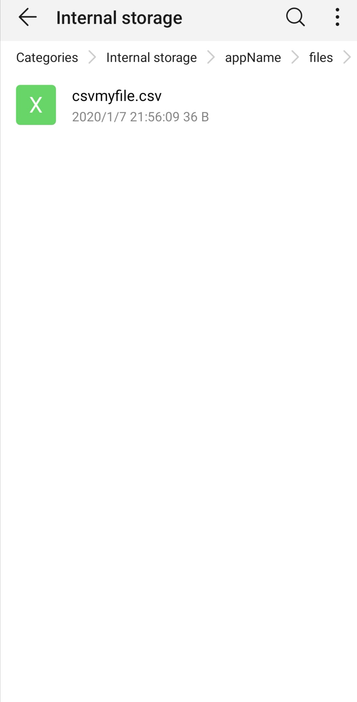

# WriteFile To specific Location
Write File Sample
Created for [this](https://stackoverflow.com/questions/59627011/android-studio-file-written-to-another-directory) stackoverflow question

## Output

This will save CSV file to Storage/appName/files

